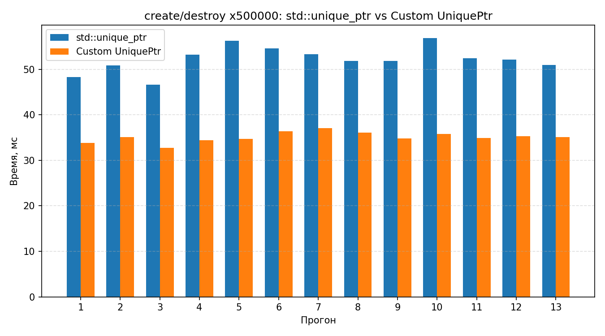
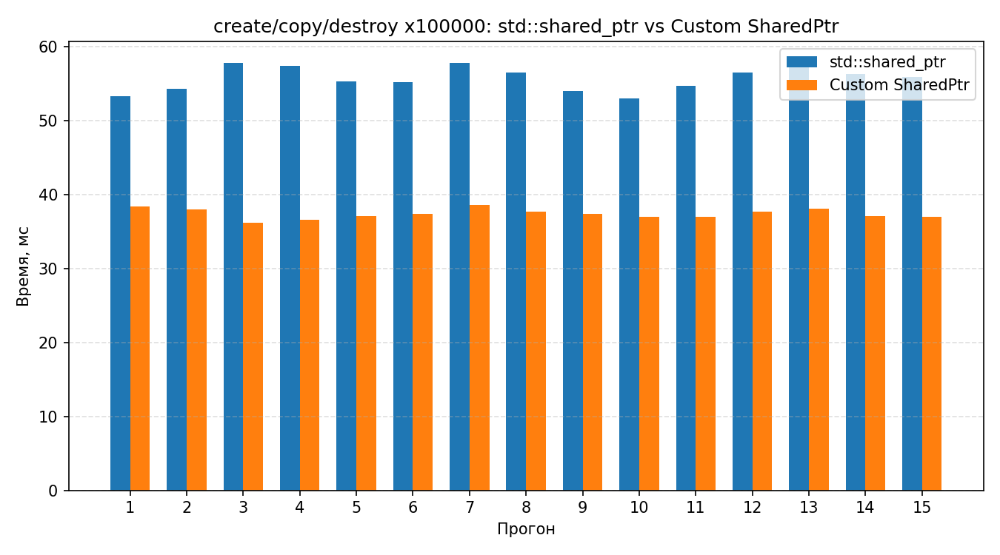

## Лабораторные работы

Проект содержит консольные реализации заданий ЛР-2 и ЛР-3. Сборка, запуск и тестирование выполняются в Ubuntu-контейнере; локальный C++-компилятор не требуется.

```powershell
docker build -t datastructures-labs:ubuntu24 .
$project = (Get-Location).Path
docker run --rm --mount "type=bind,source=$project,target=/workspace,readonly" -w /workspace datastructures-labs:ubuntu24 bash -lc 'cmake -S . -B /tmp/ds-build -DCMAKE_BUILD_TYPE=Release && cmake --build /tmp/ds-build --parallel "$(nproc)" && ctest --test-dir /tmp/ds-build --output-on-failure'
```

Команда собирает исполняемый файл и запускает весь набор тестов внутри контейнера. Чтобы интерактивно собрать и запустить программу, используйте контейнер с записью в рабочую папку для CSV-экспорта:

```powershell
docker run --rm -it --mount "type=bind,source=$project,target=/workspace" -w /workspace datastructures-labs:ubuntu24 bash -lc 'cmake -S . -B /tmp/ds-build -DCMAKE_BUILD_TYPE=Release && cmake --build /tmp/ds-build --parallel "$(nproc)" && /tmp/ds-build/DataStructures'
```

В меню выберите ЛР-2 или ЛР-3. Для проверки на произвольных данных доступны ручной и автоматический режимы; результаты замеров можно выгрузить в CSV.

### Бенчмарк для UniquePtr


### Бенчмарк для SharedPtr

